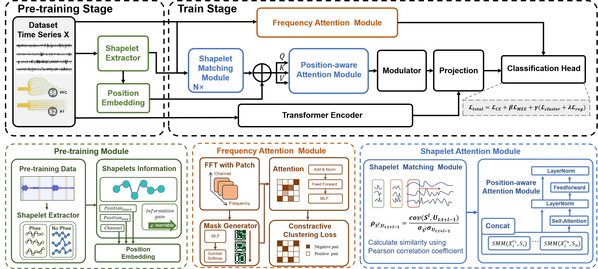

# Spontaneous Yet Predictable: Shapelet-Driven, Channel-Aware Intention Decoding from Multi-Region ECoG
Proactive intention decoding remains a critical yet underexplored challenge in brain–machine interfaces (BMIs), especially under naturalistic, self-initiated behavior. Existing systems rely on reactive decoding of motor cortex signals, resulting in substantial latency. To address this, we leverage the common marmoset’s spontaneous vocalizations and develop a high-resolution, dual-region ECoG recording paradigm targeting the prefrontal and auditory cortices and a neural decoding framework that integrates shapelet-based temporal encoding, position-aware attention, frequency-aware channel masking, contrastive clustering and a minimum error entropy-based robust loss. Our approach achieves 91.9\% accuracy up to 200 ms before vocal onset—substantially outperforming 13 competitive baselines. Our model also uncovers a functional decoupling between auditory and prefrontal regions. Furthermore, joint modeling in time and frequency domains reveals novel preparatory neural signatures preceding volitional vocal output. Together, our findings bridge the gap between foundational neuroscience and applied BMI engineering, and establish a generalizable framework for intention decoding from ecologically valid, asynchronous behaviors.

#### Acknowledgements
This work is inspired by and builds upon the open-source implementation from [xuanmay2701/shapeformer](https://github.com/xuanmay2701/shapeformer), [decisionintelligence/CATCH](https://github.com/decisionintelligence/CATCH).  
We sincerely thank the authors for sharing their code and ideas.
